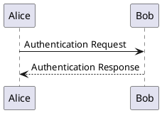
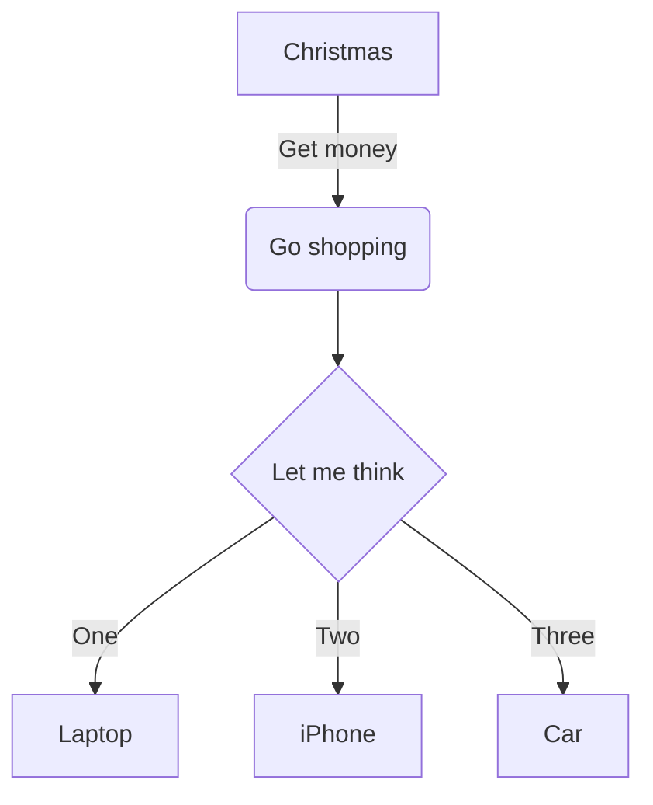

# How to write a good Qiita blog post

This is an instruction file to help you write a good Qiita blog post.

## Markdown Rules Summary

Here is a summary of Qiita's markdown rules. For more details, please refer to the [official documentation](https://qiita.com/Qiita/items/c686397e4a0f4f11683d).

## Tips for Writing a Good Blog Post

Here are some tips to help you write an effective and engaging Qiita blog post:

*   **Clear and Concise Title:** A compelling title is crucial for attracting readers. Make it descriptive and to the point.
*   **Engaging Introduction:** Start with a strong introduction that clearly states the purpose of your post and hooks the reader's interest.
*   **Structured Content:** Organize your content with clear headings, subheadings, and bullet points or numbered lists. This improves readability and helps readers follow your logic.
*   **Code Examples:** If your post involves code, provide clear, concise, and runnable examples. Explain each part of the code thoroughly.
*   **Visuals:** Use images, diagrams, screenshots, and GIFs to illustrate complex concepts, demonstrate steps, or break up large blocks of text.
*   **Proofread and Edit:** Always proofread your post for grammar, spelling, and punctuation errors. A well-written post reflects professionalism.
*   **Call to Action/Conclusion:** Conclude your post by summarizing key takeaways, asking questions to encourage comments, or suggesting next steps for readers.

### Code Blocks

You can use triple backticks (```) to create code blocks. You can also specify the language for syntax highlighting.

````
```python
print("Hello, Qiita!")
```
````

### Inline Code

You can use single backticks (`) to create inline code.

`print("Hello, Qiita!")`

### Headings

You can use `#` to create headings. The number of `#`s determines the heading level.

```
# Heading 1
## Heading 2
### Heading 3
```

### Emphasis

You can use `*` or `_` for emphasis.

- `*italic*` -> *italic*
- `**bold**` -> **bold**
- `***bold and italic***` -> ***bold and italic***

### Strikethrough

You can use `~~` to strikethrough text.

`~~strikethrough~~` -> ~~strikethrough~~

### Blockquotes

You can use `>` to create blockquotes.

> This is a blockquote.

### Lists

You can create bulleted, numbered, and checklists.

- Bulleted list item 1
- Bulleted list item 2

1. Numbered list item 1
2. Numbered list item 2

- [x] Checklist item 1
- [ ] Checklist item 2

### Links

You can create links using the following syntax:

`[Qiita](https://qiita.com)` -> [Qiita](https://qiita.com)

### Images

You can embed images using the following syntax:

``

### Tables

You can create tables using the following syntax:

| Header 1 | Header 2 |
| -------- | -------- |
| Cell 1   | Cell 2   |
| Cell 3   | Cell 4   |

### Footnotes

You can create footnotes using the following syntax:

`Here is a footnote[^1].`

`[^1]: This is the footnote.`

### Emoji

You can use emoji shortcodes, like `:tada:`.

:tada:

### PlantUML and Mermaid

You can create diagrams using PlantUML and Mermaid.

````

````

````

````
